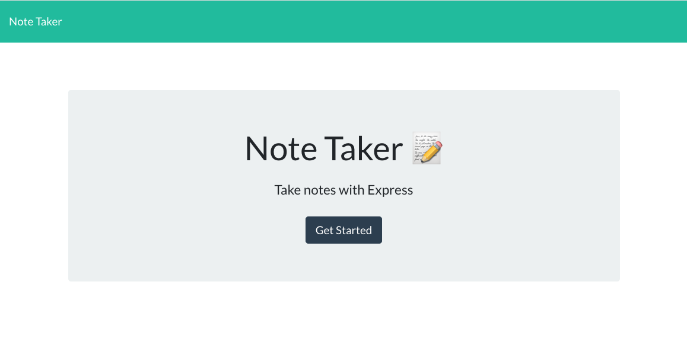
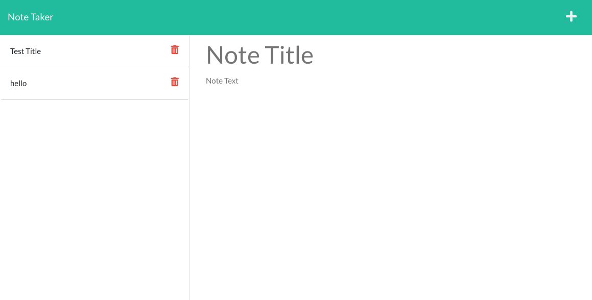

# Note Taker

  

  ## Description
  
  This application shows the use of `routing` on an `express` server. The application allows users to create notes and save them. The notes will be saved to a `json` file which is stored in the application. See below for screenshots of deployment.

  [View the live deployment](https://note-taker-nkrilis.herokuapp.com/)

  
  
  
  
  ## Table of Contents
  
  - [Installation](#installation)
  - [Usage](#usage)
  - [Contributing](#how-to-contribute)
  - [Tests](#tests)
  - [Qyestions](#questions)
  - [License](#license)
  
  ## Installation
  First clone the project locally on your computer. Then navigate to the cloned directory and run `npm install`, this will install all the required npm dependencies in order to run the application (all are defined in the `package.json` file).
  ## Usage
  Once the installation process is completed you can now run `npm start`, this will start the application server and will automatically be running at `http://localhost:3001` You can now navigate to that url in your browser and view the running application. The application also has the ability to run on a different `PORT` if specified, like when deploying to heroku.
  ## How to Contribute
  Contributors to this project are solely Nicholas Krilis. If you would like to make some changes you can fork this repository, make your additions/changes and submit your pull request(s). I will take a look and merge if all looks good, Thank you!
  ## Tests
  For this application there are no testing suites associated.
  ## Questions
  [Here you can view my Github Account](https://github.com/nkrilis)

  If you have any questions or would like to reach me you can contact me at [n.krilis@gmail.com](mailto:n.krilis@gmail.com?subject=[GitHub]%20Source%20Han%20Sans)

  ## License

    Copyright 2022 Nicholas Krilis

    Permission is hereby granted, free of charge, to any person obtaining a copy of 
    this software and associated documentation files (the "Software"), to deal in the 
    Software without restriction, including without limitation the rights to use, 
    copy, modify, merge, publish, distribute, sublicense, and/or sell copies of the Software, 
    and to permit persons to whom the Software is furnished to do so, subject 
    to the following conditions:

    The above copyright notice and this permission notice shall be included in all copies 
    or substantial portions of the Software.

    THE SOFTWARE IS PROVIDED "AS IS", WITHOUT WARRANTY OF ANY KIND, EXPRESS OR IMPLIED, 
    INCLUDING BUT NOT LIMITED TO THE WARRANTIES OF MERCHANTABILITY, FITNESS FOR A PARTICULAR 
    PURPOSE AND NONINFRINGEMENT. IN NO EVENT SHALL THE AUTHORS OR COPYRIGHT HOLDERS BE LIABLE 
    FOR ANY CLAIM, DAMAGES OR OTHER LIABILITY, WHETHER IN AN ACTION OF CONTRACT, TORT OR OTHERWISE, 
    ARISING FROM, OUT OF OR IN CONNECTION WITH THE SOFTWARE OR THE USE OR OTHER DEALINGS IN THE SOFTWARE.
    